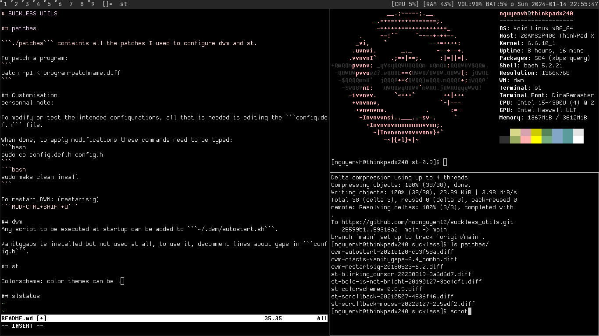

# SUCKLESS UTILS



## patches

```./patches``` containts all the patches I used to configure dwm and st.

To patch a program:
```
patch -p1 < program-patchname.diff
```

## Customisation
personnal note:

To modify or test the intended configurations, all that is needed is editing the ```config.def.h``` file. 

When done, to apply modifications these commands need to be typed:
```bash
sudo cp config.def.h config.h
```
```bash
sudo make clean insall
```

To restart DWM: (restartsig)
```MOD+CTRL+SHIFT+Q```

## dwm
MOD/SUPER key is bound to the Windows key aka ```Mod4Mask```

Any script to be executed at startup can be added to ```~/.dwm/autostart.sh```.

Vanitygaps is installed but not used at all, to use it, decomment lines about gaps in ```config.h```.

To bind volume keys, added the alsa volume commands bound with ```XF86keysym```.

## st

Colorscheme: color themes can be added or edited in ```config.h``` the ```static const ColorScheme scemes[]```. Current default theme is personal based on seoul256.

Fonts can be downloaded and moved to a ```~/.fonts``` directory and edited in ```config.h```.

## slstatus

Displaying sound volume is displayed via a script/command.

Downloaded the ```alsa-utils``` package and edited dwm config to bind sound keys.
